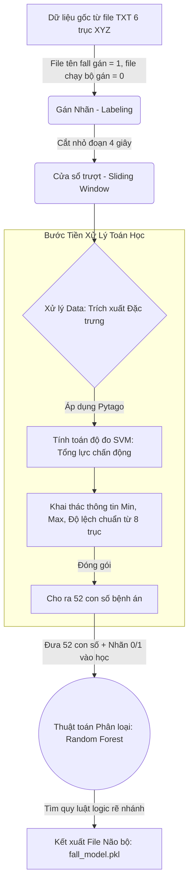

# Báo cáo: Kiến trúc thuật toán AI Phát hiện Té ngã (Fall Detection)

Tài liệu này được biên soạn nhằm giải thích cơ chế sâu từ thuật toán gốc, cấu trúc luồng dữ liệu (pipeline) và các nguyên lý toán học ứng dụng trực tiếp. 

---

## Phần 1: Toàn cảnh vòng đời của hệ thống (End-to-End Flow)

Tại máy trạm của kĩ sư phân tích dữ liệu, quy trình dạy học cho máy (Machine Learning Pipeline) diễn ra theo dòng chảy sau:

---

## Phần 2: Cụ thể 4 Bước để đúc ra Mô hình AI (Từ Data thô đến lúc Train)

Nhiều người thường nhầm lẫn vị trí của SVM và Random Forest. Dưới đây là 4 bước tuần tự giải thích chi tiết vòng đời xử lý thuật toán:

### Bước 1: Có dữ liệu và Gán nhãn (Từ đầu thu hái)
Bạn thu thập hàng trăm ngàn cuộn dữ liệu từ cảm biến. Mỗi cuộn dữ liệu thô báo về 6 trục: `Acc_x, Acc_y, Acc_z, Gyro_x, Gyro_y, Gyro_z`. Toàn bộ dữ liệu được thu ở tần số 10Hz (4 giây = 40 mẫu).
**Gán nhãn ở đâu?** Máy tính tự động nhìn tên file để dán tem ngay từ bước này. File nào thu âm lúc bạn đóng thế để ngã (`fall.txt`), máy dán tem **Nhãn = 1**. Tiếng bước chân dập nhẹ (`running.txt`), máy dán tem **Nhãn = 0**.

### Bước 2: Máy tính "SVM" vào cuộc (Tiền Train)
**Vị trí của SVM:** Nó diễn ra ở xưởng sơ chế, hoàn toàn chưa đụng gì tới bước Train AI. Đây không phải thuật toán phân loại máy học "Support Vector Machine" mà là công thức Vật lý toán học **Signal Vector Magnitude** (Mức độ lớn của Tín hiệu).

Dữ liệu 6 trục gốc tuy nhiều nhưng rất vô nghĩa vì nó biến đổi loạn xạ khi bị lộn ngược cảm biến. Kĩ sư lấy 3 trục XYZ đi qua Công thức siêu Pytago chéo không gian tên là SVM ($SVM = \sqrt{x^2 + y^2 + z^2}$).
**SVM tạo ra cái gì? Chú ý kĩ chỗ này: SVM KHÔNG tạo ra 52 đặc trưng!**
- Nó cầm 3 trục gia tốc rườm rà gộp thành **1 Trục Tổng** (gọi là $SVM_{Acc}$). Trục này mang ý nghĩa vô cùng quan trọng: Phản ánh *Tổng Lực Chấn Động* dội lên cơ thể.
- Nó tiếp tục cầm 3 trục con quay gộp thành **1 Trục Tổng** (gọi là $SVM_{Gyro}$). Trục này phản ánh *Tổng Lực Xoáy/Lộn vòng*.
$\rightarrow$ Vậy sau bước SVM, từ "6 trục gốc", dữ liệu bồi đắp thêm thành **"8 trục"** (6 trục nguyên bản + 2 cái trục tổng lực tinh hoa vừa tính ra).

### Bước 3: Đẻ ra "52 con số đặc tính" (Khai thác thông tin Feature Extraction)
Thuật toán AI Random Forest sẽ bị "mù" nếu bạn quăng cho nó 1 cái bảng 40 dòng lộn xộn dọc ngang. Nó yêu cầu tóm lược tình huống 4 giây đó thành 1 dòng điểm số duy nhất! Giai đoạn này, ta cho cả bộ 8 trục ở (Bước 2) đi qua một chiếc máy ép thống kê:
- Nó lục lọi trên trục $SVM_{Acc}$ tìm đỉnh $\rightarrow$ đẻ ra con số **Max** (để xem lực va đập chạm đất có lên tới 4G không).
- Nó lục lọi trên trục $SVM_{Gyro}$ $\rightarrow$ đẻ ra con số **Min**.
- Nó đo độ phân tán (**STD** - Độ hoảng loạn của dao động) trên cả 6 trục gốc $\rightarrow$ đẻ ra thêm cả loạt số Std...
Tổng cộng tìm kiếm hết các đại lượng Max, Min, Std, RMS (Năng lượng)... tịnh tiến trên toàn bộ 8 trục. **Hệ thống đẻ ra chính xác 52 điểm số!**

### Bước 4: Chuyển dữ liệu vào Train bằng Máy Random Forest
Bây giờ, thay vì 1 cục data khổng lồ vô nghĩa nguyên bản, cứ 1 cú chuyển động chỉ còn quy gọn lại thành một Hồ Sơ duy nhất là **[52 Con Số Đặc Tính]**.
Nhưng đừng quên, bộ hồ sơ này vẫn còn dính chặt với cái tem **[Nhãn = 1 hoặc 0]** mà ta đã phân loại ở tận Bước 1. Trộn 2 thứ này ghép lại làm một. (Tỉ dụ gộp lại thành 1 sheet Excel hàng nghìn dòng. Cột 1 đến Cột 52 là Số liệu đo, Cột 53 ngoài cùng là đáp án NHÃN `1` (Ngã) hoặc NHÃN `0` (Không)).

Tới tận lúc này, con AI **Random Forest** mới chính thức ra màn chào hỏi mở cửa. Cỗ máy Random Forest nhai ngấu nghiến bảng Excel đó (Quá trình Train). Thuật toán này không phải con người, nó "phát hiện" ngã bằng cách tự đúc kết ra các chân lý logic ràng buộc chéo: *"À, tôi nhận ra cứ con số thứ 13 (Đỉnh lực Max) mà tự nhiên cao thủng trần 3G, rồi đồng thời con số thứ 42 (STD Góc xoay) bị xiên lệch bất thường, thì kiểu gì tỷ lệ cột đáp án ngoài cùng cũng = 1!"*. 

Thế là sau hàng vạn vòng lặp, mô hình AI được hình thành và các quy luật đó được xuất/bảo lưu thành tệp nén mang tên `fall_model.pkl`.

---

## Phần 3: Ứng dụng thực tế: Tại sao file model `.pkl` lại đưa ra được câu trả lời?

Trong bối cảnh AI nổi tiếng hiện nay, nếu bạn đã quen với ChatGPT (LLM), có thể bạn sẽ thắc mắc: *"File .pkl này đưa ra câu trả lời như thế nào khi nó đâu có bộ từ vựng hay cơ chế sinh ra ngôn ngữ?"*

**Sự phân biệt cốt lõi:** Mô hình nhận diện té ngã của chúng ta hoàn toàn không phải là mô hình *Sinh tạo (Generative AI)*. Nó là dạng mô hình **Phân loại nhị phân (Binary Classification AI)**. 

File `fall_model.pkl` nặng vài trăm KB kia thực chất chỉ là một file đóng gói nén chứa hàng nghìn **Câu lệnh Rẽ nhánh (IF-THEN-ELSE)** và các trọng số toán học đã được biên dịch thành mã máy. Khi thiết bị chạy trên thực tế:
1. ESP32 gửi dữ liệu mới tinh về, Python máy chủ băm vằm luồng dữ liệu đó ép ra 52 con số y hệt thao tác ở trên.
2. Lập trình viên lập trình thảy mảng 52 con số này "đút" vào file `.pkl` qua hàm `.predict()`.
3. File `.pkl` cầm 52 con số này chui tọt qua hàng nghìn mạng lưới IF-ELSE tĩnh (Ví dụ: `Dòng chạy chạm IF Number_13 > 3.0: đi sang nhánh Trái...`). Quá trình xử lý mạch logic này bằng CPU tốn chưa tới $1$ mili-giây.
4. Câu trả lời văng ra khỏi file `.pkl` cuối cùng không phải là câu chào *"Dạ có ngã thưa sếp"*. Mà nó chỉ văng ra duy nhất mã nhị phân **Số `1`** hoặc **Số `0`**.
5. Kỹ sư Server dùng code để hứng con số đó: `if ket_qua == 1: gui_khan_cap_len_app()`. Hiển thị còi báo động màu đỏ trên web hay gửi tin nhắn SMS là do tác vụ của Backend, còn tự bản thân tệp `.pkl` hoàn toàn là câm lặng làm toán!

---

## Phần 4: Bản chất cơ chế Bỏ Phiếu của Random Forest

Tại sao ta xài cái thuật toán lằng nhằng này mà không xài luật mồm tự code "Thì tóm lại cứ thấy Max trên 3G với lệch chuẩn lớn thì code mẹ cái If-Else = Ngã cho rẻ"? 

Bởi vì: Đời không như là mơ! Việc tay người tự Set một con số cố định sẽ tạo ra độ trễ cực rủi ro và cực kì dễ sinh ra hoang báo (False Positive): xẩy chân, làm rơi móc khóa giật mình hay quỳ gối cũng tự nhiên nổ còi ầm ĩ!

Con AI Random Forest (Rừng Ngẫu Nhiên) giải quyết việc đó bằng cơ chế vi diệu nhất của nó: **Cơ chế Hội đồng (Ensemble Learning)**:
- **Dựng 200 chuyên gia tinh túy:** Cái file `.pkl` chứa 200 Cây Quyết Định bên trong. Mỗi cây lại được ghim độc quyền nghiên cứu từng trường phái đặc trưng nhỏ. Cây cắm vào phân tích góc xoáy. Cây thì chuyên môn đo độ rơi mất trọng lượng... 
- **Bỏ phiếu Quyết Định (Voting):** Giờ chạy thực tế. Đổ 52 con số tình huống xuống 200 hệ cây như thác.
  - Cây giám định 1: "NGÃ!"
  - Cây 2: "Yes, ca này ngã!"
  - Cây giám định 3: "Khoan, dao động thấp, góc nghiêng về trục Z xoay nhẹ thế này chỉ là cúi gập quỳ rạp tìm đồ rớt."
- **Chốt phán quyết:** Cấu hình lập trình sẽ gông lại (ví dụ ngưỡng `prob > 0.7`): Chỉ khi nào tổng kết toàn rừng có mặt lấn lướt áp đảo **hơn 140 cây quy chiếu (70%) chốt đồng ý 100% là NGÃ**, file `.pkl` mới cho phép nhả ra số `1`. Nhờ bỏ phiếu đa số như vậy, mô hình AI đã hoàn toàn san phẳng đi các điểm cực đoan của một quyết định sai lầm.
